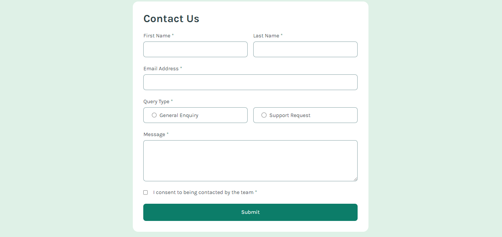
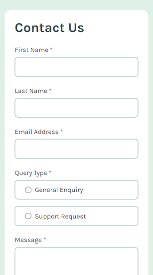

# Contact Form | Frontend Mentor

This is a solution to the Contact Form challenge on Frontend Mentor. It is a responsive form that allows users to submit their details with proper validation and interactive feedback.

---

## Table of Contents

- [Overview](#overview)
  - [The Challenge](#the-challenge)
  - [Screenshot](#screenshot)
  - [Links](#links)
- [My Process](#my-process)
  - [Built With](#built-with)
  - [What I Learned](#what-i-learned)
  - [Continued Development](#continued-development)
- [Author](#author)

---

## Overview

### The Challenge

Users should be able to:

- Fill out the form with:
  - Name
  - Email address
  - Message
- See validation errors for:
  - Required fields
  - Invalid email format
- Submit the form successfully
- View success message after submission
- Experience responsive design across devices
- See hover, focus, and active states for inputs and buttons

---

### Screenshot

| Desktop | Mobile |
|---------|--------|
|  |  |

---

### Links

- Repository:  
  https://github.com/IrfanAnsari21/contact-form.git  

- Live Site:  
  https://irfanansari21.github.io/contact-form/

---

## My Process

### Built With

- Semantic HTML5
- CSS (Flexbox / Grid / Responsive Design)
- JavaScript (Form Validation & DOM Manipulation)
- Mobile-first workflow

---

### What I Learned

- Form validation using JavaScript
- Handling user input and error states
- Improving accessibility with proper labels and structure
- Managing form submission and success feedback
- Writing cleaner and more structured code

---

### Continued Development

- Improve accessibility (ARIA attributes, screen reader support)
- Enhance UI/UX with better animations and transitions
- Optimize validation logic

---

## Author

- GitHub:  [@IrfanAnsari21](https://github.com/IrfanAnsari21)

- Frontend Mentor:  [@IrfanAnsari21](https://www.frontendmentor.io/profile/IrfanAnsari21)

---

## Acknowledgments

Thanks to **Frontend Mentor** for providing this challenge to improve real-world frontend skills.